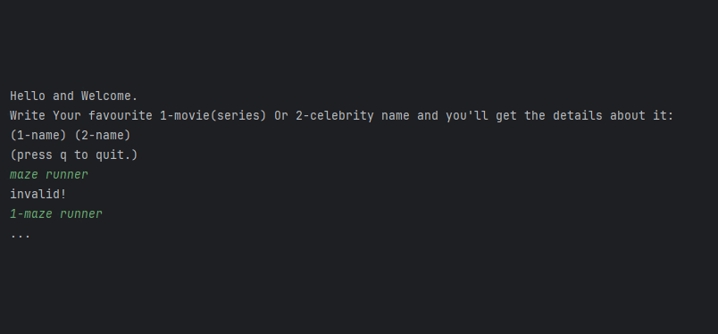

# Project Title

Movies & celebrities API Project

## Description

Search your favourite movies(series) or celebrities
and get info about them.\
You can also search Top Actors in Movies(Series) .

## Getting Started

### Dependencies

* org.json (For API Response Handling)
* some Unit Test Dependencies

### Installing

* You can download the project, here on [GitHub](https://github.com/HoseinA05/Second-Assignment-CineScribe).

### Executing program

* First compile each class file, then 
run the Main Class using the jvm.

## Help

There are some unhandled errors which I
couldn't figure out where are they coming from.

## Authors

No contributors, Just myself!
[@HoseinA05](https://github.com/HoseinA05)

## Version History

* 0.1
    * Initial Release (Base features)

## Acknowledgments

* [Java Try-Catch explanation](https://www.javatpoint.com/try-catch-block)
* [Movies API Website](https://omdbapi.com/)
* [Celebrities API Website](https://api-ninjas.com/api/celebrity)
* [Printing Double without floating point (printf)](https://stackoverflow.com/questions/16098046/how-do-i-print-a-double-value-without-scientific-notation-using-java)
* [exception-thrown-inside-catch-block-will-it-be-caught-again ?](https://stackoverflow.com/questions/143622/exception-thrown-inside-catch-block-will-it-be-caught-again)
